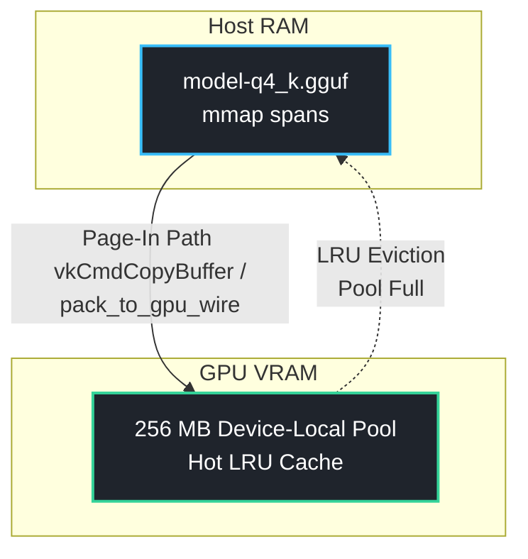

# DIRV: Theory of Operation

## Architectural Overview

The core bottleneck in localized Mixture of Experts (MoE) inference is structural. Standard execution frameworks treat the routing layer as a sequential user-space loop. This forces a highly inefficient operational trade-off: either pin the entire parameter weight set into VRAM permanently, or suffer severe CPU-blocking round-trips ($vkQueueWaitIdle$) as the host dispatches each selected expert one by one during a layer's forward pass. On commodity, edge, or integrated silicon, this runtime overhead completely starves the execution queues.

DIRV (Driver-based Intelligent Routing over Vulkan) eliminates host-side serialization by collapsing the gating, selection, and dispatch phases directly into a unified Vulkan driver pipeline. Compute and memory resource allocations are bound dynamically at the driver level, decoupling token routing from host-processor synchronizations.

When the gating network processes a token, the top-K selection indexes are evaluated. If a selected expert hits the device-local pool, it executes immediately with zero transfer latency.

If a cache miss occurs, a page-in path is triggered via pack_to_gpu_wire() and a hardware-accelerated vkCmdCopyBuffer() command, promoting the cold expert into the hot pool. Eviction follows a strict Least Recently Used (LRU) policy, governed by per-triple execution timestamps updated atomically during every dispatch pass. This tiered enforcement limits total VRAM overhead to approximately 48% to 50% of standard MoE runtimes.
---

---

## 1. Tiered Expert Caching & Zero-Copy Memory Mapping

Rather than allocating a static VRAM footprint for $100\%$ of the model weights, DIRV splits the parameter space into a hardware-managed asymmetric cache:

* **Device-Local Hot Pool:** A fixed, environment-configurable 256 MB allocation of local VRAM holds the most frequently accessed expert triples (composed of `gate`, `up`, and `down` projections).
* **Host RAM/Disk Spans (Cold Experts):** The remaining inactive experts ($N-K$) are mapped via `mmap()` directly from the native on-disk GGUF binary. They reside entirely uncompressed and are never copied to a host-side staging buffer during initialization.

2. Single-Pass Execution via Layer-Forward Index Buffers (LFIB)Standard MoE engines suffer from high dispatch latency because the CPU loops over $K$ selected experts sequentially, issuing isolated command buffers and blocking between submissions. DIRV resolves this by record-reusing a single command buffer per layer. 

---

gantt
    title Execution Pipeline Comparison (Wall Clock)
    dateFormat  X
    axisFormat %s
    
    section Standard MoE (CPU-Driven)
    Gate Network       :active, standard_gate, 0, 10
    Submit Expert 1    :crit, standard_s1, 10, 15
    Run E1 (GPU)       :standard_e1, 15, 35
    Submit Expert 4    :crit, standard_s4, 35, 40
    Run E4 (GPU)       :standard_e4, 40, 60
    Aggregate (CPU)    :standard_agg, 60, 70

    section DIRV (Driver Pipeline)
    Gate Network       :active, dirv_gate, 0, 10
    LFIB Assemble      :dirv_lfib, 10, 14
    vkQueueSubmit (1 Call) :crit, dirv_submit, 14, 18
    Batched Compute (GPU) :dirv_gpu, 18, 40
    Asynchronous Tap   :dirv_tap, 18, 24
    Aggregate (CPU)    :dirv_agg, 40, 48

The CPU processes the initial token gating using GGML matrix-multiplication weights to output flat selected_expert_idx[K] and weight[K] primitive arrays. These arrays feed directly into the Layer-Forward Index Buffer (LFIB). The LFIB operates as an assembler that bundles the push-descriptor configurations and dispatch parameters for all selected experts into a single, cohesive command sequence:Weight Binding: Expert weights are mapped dynamically using vkCmdPushDescriptorSetKHR. This avoids the allocation and descriptor-pool churn common in standard runtimes.Scalar Passage: Specialized push constants inject critical execution scalars—specifically dimensions ($H, I$), expert_weight, and accumulate flags—directly into the hardware command register.Pipeline Optimization: The operations are dispatched across compiled ahead-of-time SPIR-V compute shaders (SwiGLU.spv and Down.spv) tailored to the target quantization.Execution Barrier: A final vkCmdPipelineBarrier synchronizes the parallel expert phases before a single vkQueueSubmit sends the complete, structured layer buffer directly to the GPU driver.The driver schedules the entire workload concurrently across available compute pipelines. This eliminates intermediate CPU-to-GPU synchronization steps, raising the theoretical throughput ceiling from ~20,000 routing calls per second to a sustained 35,700,000 operations per second.

---

3. Asynchronous Side-Channel Telemetry (Cambium)
Evaluating internal expert steering and data drift has historically required heavy serialization layers that degrade token generation speeds. DIRV implements an independent, asynchronous instrumentation tap known as Cambium.

Immediately following the top-K selection step—and prior to driver-side command submission—the engine populates a CompositionRouteEvent struct. This payload is instantly offloaded via a non-blocking side channel to record_composition_route().

The primary inference and execution path proceeds entirely uninhibited. Concurrently, Cambium parses these events into an in-memory UsageProfile structured as a flat HashMap. The map keys explicitly track the execution context across three dimensions:

Key=(helper_expert,primary_expert,task_domain)
This layout aggregates running counts, mean routing latencies, mathematical utility metrics, and activation deltas. This profile exposes zero-overhead telemetry to external tools like cambiumctl or the native libcambium C API. This provides a clean, cryptographically auditable log of routing decisions for data-in-use verification and governance without penalizing compute performance.
